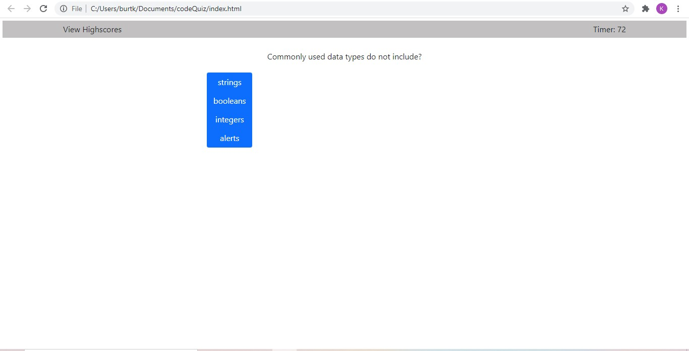

# codeQuiz

*A multiple choice quiz that renders dynamically and saves users scores

*Usage: used as a URL in any standard web browser and as a test of coding knowledge

https://burtk33.github.io/passwordGenerator/

*Developed by Kyle Burt
